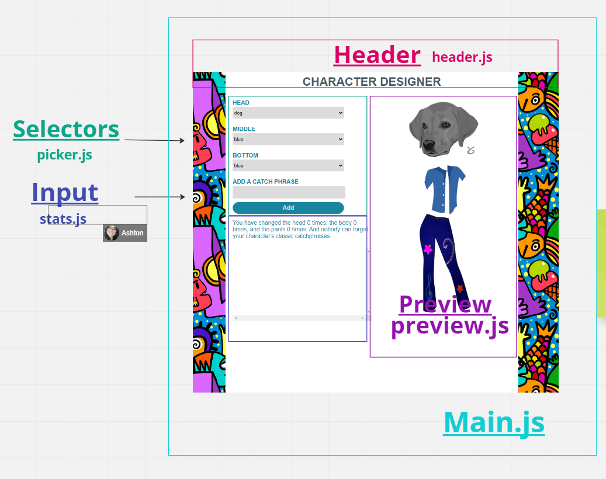

# Character Builder Planning

## Miro Board

https://miro.com/app/board/uXjVPypVGfk=/

## Order of operations

1. Head Control and updating the preview (ignore count)
2. middle control and updating the preview (ignore count)
3. bottom control and updating the preview (ignore count)
4. Add the count
5. Add the catchphrases
